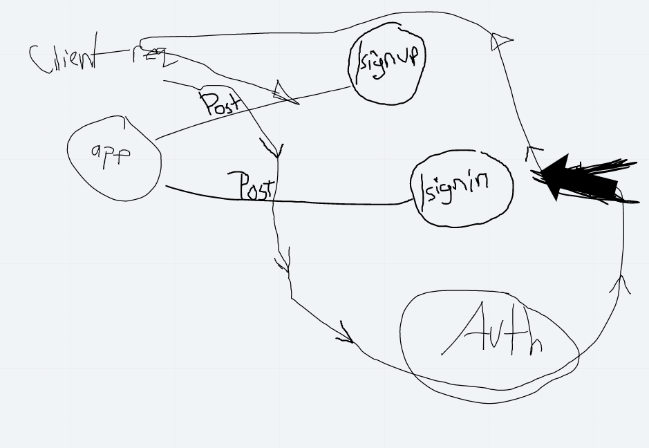

# LAB: Authentication

Authentication System Phase 1: Deploy an Express server that implements Basic Authentication, with signup and signin capabilities, using a Mongo database for storage

## Author: Carly Dekock

## [Link to GitHub repository](https://github.com/carlydekock/basic-auth.git)
## [Link to PR](https://github.com/carlydekock/basic-auth/pull/2)

## Deployed links

- [Link to GitHub actions](https://github.com/carlydekock/basic-auth/actions)

## The Setup

### How to install

- Clone down repository from GitHub
- Run the command ```npm install``` to install dependencies (dotenv, express, jest, supertest, mongoose, base-64, bcrypt, supergoose)
- create .env file with PORT variable and MONGODB_URI

### How to test

- Run the command ```npm test``` to test and verify the server is working

### How to run

- Start the server using ```nodemon```
- Visit http://localhost:PORT at the PORT number you've assigned in your .env

## UML


## Credits and Collaborations

- Worked at lab table with Jason Q, Jason D, Nick M, Seid
